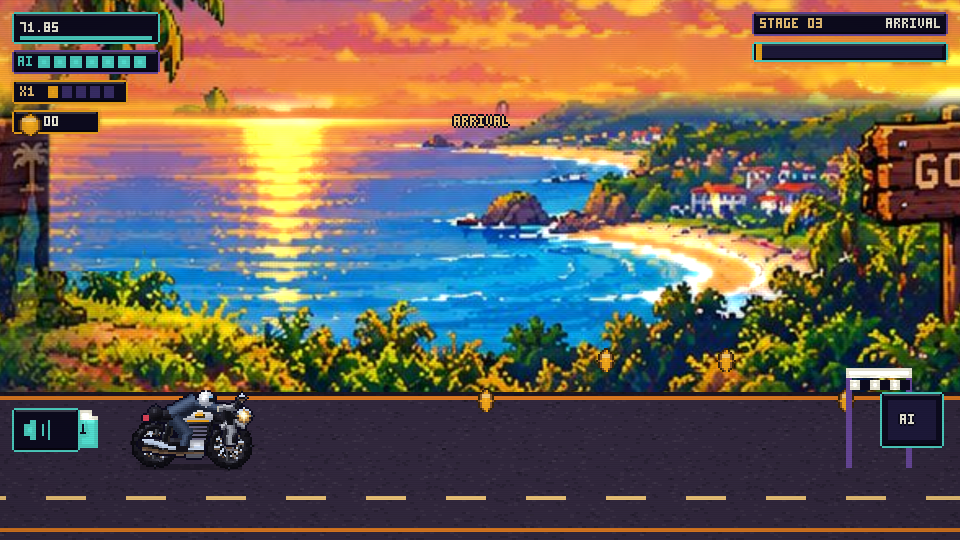
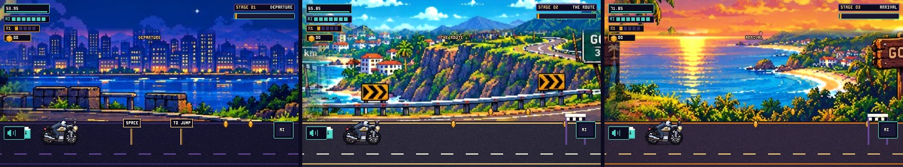

# Next Mile

A pixel-art motorcycle runner that fits in one HTML file. Three authored stages, one clock, and an
AI that will ride for you — but collects nothing, and costs you the run.



## Play it

Download [`index.html`](index.html) and open it in a browser. That's the whole install. No build step,
no bundler, no `npm install`, no server — the game, the art and the audio are all in that one file.

| Action | Keys |
|---|---|
| **Jump** | `Space` · `W` · `↑` |
| **Throttle** | `D` · `→` |
| **Brake** — hold it to charge a launch, then jump | `A` · `←` |
| **Fall fast** — hold it in the air | `S` · `↓` |
| **AI assist** | `E` · `Shift` |
| **Restart / pause** | `R` · `P` or `Esc` |
| **Mute / fullscreen** | `M` · `F` |
| **Screen shake / effects** | `K` · `G` |

On touch, tap anywhere to jump; brake, gas and AI are on-screen buttons, and holding brake charges
the same launch. Controls are read from `event.code`, so WASD works on AZERTY too.

## The idea

Most runners punish you for failing. This one punishes you for being rescued.

Press `E` and an AI takes over. It rides — slowly, safely, and it will not crash. It also collects
nothing, drains your battery, drops your multiplier to nothing and puts a rescue on the record that
fails every stage goal. It cannot save you from the clock. The clock is the only thing that can beat
you, and the AI is always slower than you are.

So the question the game asks is never "can you survive this?" It's "how long can you go without
help?"

## The three stages



| | Stage | Distance | Clock | Feel |
|---|---|---|---|---|
| 01 | **Departure** — *new roads, same soul* | 5,800 px | 54 s | Night city, river reflections |
| 02 | **The Route** — *explore, ride, discover* | 7,320 px | 66 s | Coastal cliff and crash barrier |
| 03 | **Arrival** — *some journeys change you* | 8,820 px | 72 s | Goa at sunset |

Stages 1 and 2 are clearable on a cautious cruise. Stage 3 is not — at cruise it runs 76.1 s against
a 72 s clock, so the last stage demands the throttle. That's deliberate, and it's asserted in the
test suite rather than left to feel.

## How it's built

| | |
|---|---|
| **Renderer** | Canvas 2D, 480×270 backbuffer, `image-rendering: pixelated` |
| **Loop** | Fixed timestep at 1/120 s with an accumulator, plus render interpolation between steps |
| **Physics** | Hand-rolled. `vy += g·dt` and AABB overlap. No engine, and none is needed |
| **Randomness** | Seeded `splitmix32`. No `Math.random()` in the simulation — runs are reproducible |
| **Audio** | Web Audio, fully synthesised. No sample files |
| **Bike & obstacles** | Drawn from primitives at load and cached as bitmaps, not photographed |
| **Shading** | Procedural matcaps — chrome, silver paint, cast aluminium, leather — one texture lookup per pixel |
| **Build** | None |
| **Dependencies** | One: the *Press Start 2P* webfont from Google Fonts |

Everything that can be baked is baked once at load into a cached bitmap, so the per-frame cost is
blits rather than thousands of `fillRect` calls. Every forgiveness window — coyote time, jump
buffering, hitstop — is expressed in **seconds**, not frames, so it doesn't change length with your
refresh rate.

### Deliberate constraints

- **No colour-only information.** Contrast is checked against the moving scene, not a flat swatch.
- **Nothing flashes more than three times per second** (WCAG 2.3.1 Level A), and the budget is
  asserted across *concurrent* blinkers, not one at a time.
- **Screen shake is a render-only camera offset** using the trauma model (`shake = trauma²`), behind
  a 0–100 % slider, and zeroed under `prefers-reduced-motion`.
- **Full keyboard path** — start, play, pause, restart, exit.

## Repository layout

```
index.html          the entire game (2,646 lines; line 69 is a 479 KB inlined asset blob)
src/assets/         source art at native resolution — the editable originals
tools/              test suite and the asset pipeline
docs/               screenshots
QUICKSTART.md       working notes for contributors and agents
```

`src/assets/` is the source of truth for the artwork. The images in `index.html` are base64 copies of
those files; edit the originals and re-inline, never the blob.

## Tests

```powershell
.\tools\test.cmd
```

**93 assertions, no dependencies.** Node isn't required — the suite runs on the Windows JScript
engine (`cscript`), polyfilling ES5 and stubbing the DOM, canvas and audio so it can execute the
*real* game code rather than a copy of it.

| Suite | What it proves |
|---|---|
| [`tools/parse.js`](tools/parse.js) | The script parses (`new Function`, no execution) |
| [`tools/smoke.js`](tools/smoke.js) | Boot, seeded-RNG determinism, the trauma ladder renders non-zero pixels, coin-tier reachability and reward ordering, minimum obstacle gap across all three stages, clock pacing, checkpoint placement, battery separation, flash budget, and that every art constant is a fraction of the image it indexes |
| [`tools/play.js`](tools/play.js) | Behavioural. Drives an autopilot through all three stages and asserts that doing nothing loses the run, that a competent rider clears all three with clock to spare, that cruise clears 1–2 but stage 3 demands the throttle, and that camera lookahead opens and closes |
| [`tools/compare.js`](tools/compare.js) | Diffs simulation outcomes between two builds |

Two caveats worth knowing. JScript is ES3, so the harness shims string indexing (`s[i]`) that every
real browser supports — a harness limitation, not a bug. And `play.js`'s cruise-time model is
approximate; where it and `smoke.js` disagree, **`play.js` is authoritative**, because it actually
simulates the braking.

## Changing the art

```powershell
.\tools\reinline.ps1 -WhatIf    # report what would change, write nothing
.\tools\reinline.ps1            # rebuild index.html's asset blob from src\assets\
.\tools\test.cmd                # always re-run after
```

Assets present in the blob but absent from the folder are left untouched, so partial updates are
safe. Constants that index into the artwork are written as **fractions of the source image**, never
as pixel counts, so re-exporting the art at 2× or 4× is drop-in — and the test suite reads those
fractions out of `index.html` and checks they still round correctly at both 1× and 2×.

## Licence

[MIT](LICENSE) © 2026 Prajwat Srivastava.

Two things the MIT grant does **not** cover, because they aren't mine to license:

- **Royal Enfield trademarks.** The name, the marks and the `#ArtOfMotorcycling` campaign belong to
  Royal Enfield. This project is styled after the Continental GT 650 but is not affiliated with,
  sponsored by or endorsed by them, and the MIT licence grants you no rights to their branding.
- **The typeface.** [Press Start 2P](https://fonts.google.com/specimen/Press+Start+2P) by CodeMan38
  is under the SIL Open Font License, not MIT.

Everything else — the code in `index.html`, the tooling in `tools/` and the stage artwork in
`src/assets/` — is MIT.
